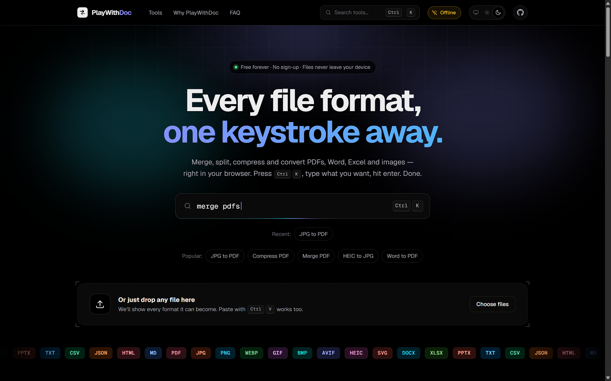
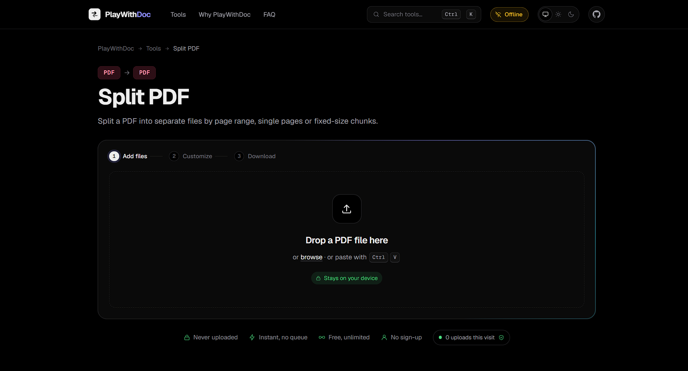

<div align="center">

# PlayWithDoc

### Press **Ctrl + K**. Type what you want. Done.

**Every PDF, image and document tool — in one keystroke, in your browser, even offline.**
No sign‑up · No uploads · No limits · Free

[](https://github.com/Tirth-Babariya/playwithdoc/actions/workflows/ci.yml)
[](LICENSE)

[**Built by Tirth Babariya →**](https://github.com/Tirth-Babariya/)

<br />



<sub>Home screen · press <b>Ctrl + K</b> anywhere to jump to any tool</sub>

</div>

---

## The idea: never leave the page

Most converter sites make you hunt: open a new tab, Google *"jpg to pdf"*, dodge ads, find the right page, upload your file, wait, download, then start over for the next step.

**PlayWithDoc removes all of that.**

> Press **`Ctrl + K`** (or **`⌘ K`**, or **`Ctrl + S`**, or **`/`**) — from *any* page — and type what you want.
> `jpg to pdf` · `compress` · `sign` · `heic` · `merge` · `ocr` · `word to pdf`
> Hit **Enter**. You're in the tool. That's it.

No navbar hunting. No new tabs. No searching the web. You can jump **from anywhere to anywhere** — and when a conversion finishes, **send the result straight into the next tool** without downloading and re‑uploading:

```
Word ─▶ PDF ─▶ Compress ─▶ Sign ─▶ Protect ─▶ Download
                 (one click between each step)
```

Or don't even pick a tool — **drop any file on the home page** and PlayWithDoc shows every format it can become.

---

## Works offline — really

PlayWithDoc is **offline‑first**. The first time you open it, it saves itself to your device:

| | |
|---|---|
| ✅ **Every page & script** | Cached at install, so tools you've *never opened* still work with no connection |
| ✅ **Core engines** | PDF, Word, Excel, PowerPoint, qpdf (protect/unlock/repair) — all local |
| ✅ **Optional OCR + HEIC pack** | ~24 MB, 9 languages, downloaded only if you ask (from the **Offline ready** menu) |
| ✅ **Installable** | Add it to your desktop or phone home screen like a native app |
| ✅ **Quiet updates** | New versions install in the background and wait for you to press *Update* |

<div align="center">



<sub>Airplane mode: the navbar shows an <b>Offline</b> pill, every tool still works — and the live badge reads <b>0 uploads</b></sub>

</div>

Get on a plane, lose Wi‑Fi, open a PDF on a train — it just works. *(This is tested: the automated suite turns the network off and runs merge, protect, Word→PDF, PDF→JPG, opens the sign editor, and runs OCR.)*

---

## Private by design — and provable

Your files **never leave your device**. Everything is processed by your browser.

- **Live proof:** every tool page shows a *"0 uploads this visit"* badge that counts any request the page's own code makes.
- **Enforced by the browser:** the site ships a strict `Content-Security-Policy` (`connect-src 'self'`), so even a bug or a tampered script cannot send data to another website.
- **Verify it yourself:** open DevTools → Network while converting. Nothing leaves.
- **Self‑hosted everything:** fonts and engines (pdf.js, pdf‑lib, qpdf, Tesseract…) are served from this site — no third‑party requests.
- **No accounts, no analytics, no ads, no cookies to track you.** The only thing stored is on *your* device (theme, recent tools, saved signatures).

---

## What you can do

**76 tools**, all free, all local.

| | |
|---|---|
| **Organize** | Merge · Split · Remove pages · Extract pages · Organize (drag thumbnails, rotate, delete) · Scan to PDF (phone camera) |
| **Optimize** | Compress (lossless / balanced / smallest / **target size**) · Repair · **OCR PDF** (make scans searchable) |
| **To PDF** | JPG · PNG · WebP · HEIC · any image · **Word** · **Excel/CSV** · **PowerPoint** · HTML · Text |
| **From PDF** | JPG · PNG · **Word** · **PowerPoint** · Text · Markdown · **Excel (tables)** · **Scan → Text (OCR, 9 languages)** |
| **Edit** | **Edit PDF** (text, whiteout, highlight, draw, images) · **Fill PDF form** · **Compare PDFs** (changes marked in red) · Rotate · Crop · Page numbers · Watermark |
| **Security** | **Sign PDF** (draw / type / upload) · **Protect** (AES‑256) · **Unlock** · **Redact** (truly removes text) |
| **Images** | 21 image ⇄ image conversions (JPG, PNG, WebP, GIF, BMP, AVIF, HEIC, SVG) · Compress (**under 100 KB**) · Resize · **Photo & signature presets** (passport, visa, signature under 20 KB) |
| **Markdown** | Markdown → **PDF · Word · HTML · text** · **Word → Markdown** · **HTML → Markdown** · PDF → Markdown |
| **Data** | CSV ⇄ JSON · Excel → CSV / JSON |

### Little things that feel good

- 🖼️ **Real previews** of every file — images, PDF pages, HEIC, even text snippets
- ↔️ **Drag to reorder** — cards glide out of the way as you drag; **rotate** each image; **Sort A–Z**
- 🔍 **Click to zoom** any preview full‑screen (← → to browse, **R** to rotate)
- 🗜️ **Target‑size compression** — "make this under 100 KB" for strict upload forms
- 👀 **Before / after slider** and a **live size estimate** before you convert
- ✏️ **Rename before download** (click the file name) · **Save to folder**
- ⌨️ **Keyboard everywhere** — see the table below
- 🌗 **Light / dark / system** theme · fully responsive · installable

---

## Recipes: do several things in one go

Open **Recipes** in the navbar (or press <kbd>Ctrl</kbd> + <kbd>K</kbd> and type *recipe*) to chain steps and run them on your files in one click:

```
Merge  ─▶  Compress under 1 MB  ─▶  Watermark  ─▶  Protect with a password
```

Start from a ready-made recipe — *Email-ready PDF*, *Scans → searchable & small*, *Confidential copy*, *Photos → one small PDF*, *Word → protected PDF* — or build your own, tweak every step's options, and **save it on your device** to re-run any time. The steps are checked as you build (a tool that can't accept the previous step's output is flagged), and everything still runs locally.

## Forms, photos and comparing

- **Fill PDF form** lists every fillable field — text boxes, check boxes, radio buttons, drop-downs — with a progress bar and search, then saves the filled PDF (optionally locked in place). A flat PDF with no fields is handed straight to *Edit PDF*.
- **Photo & signature presets** frame your photo to an exact size **and** file limit: passport 35×45 mm (under 200 KB), US visa 2×2 in, profile picture, signature 140×60 under 20 KB — or a custom size. Drag to position, zoom, and use the guides; a photographed signature can be cleaned to crisp ink on white.
- **Compare PDFs** puts the original (A) next to the new version (B) and produces a report: changed areas in red, plus the words that were added or removed on each page.
- **PDF to Excel** turns tables in text-based PDFs into a workbook, with numbers converted to real numbers.

## Guides and proof

- **How-to guides** — 18 short, step-by-step articles for the things people search for most ("Reduce a PDF to under 200 KB", "Sign a PDF without uploading it", "Make a passport photo at home"…). Each ends at the tool that does the job, has FAQ and search-engine structured data, and links to related guides.
- **Prove it** (`/prove-it`) — a live demonstration instead of a promise: a running count of every network request the page makes (other websites: 0), a demo that reads a file you choose and shows nothing left the tab, a button that *tries* to send data to another site so you can watch the browser block it, and the actual security policy read from the server. It ends with four ways to check it yourself, and an honest list of what can't be promised.

## Keyboard

| Keys | Does |
|---|---|
| **Ctrl/⌘ + K**, **Ctrl/⌘ + S**, **/** | Open search — go to any tool from anywhere |
| **Enter** | Open the highlighted tool |
| **Ctrl/⌘ + O** | Add files |
| **Ctrl/⌘ + Enter** | Convert · or download the result |
| **Ctrl/⌘ + V** | Paste a screenshot or file straight in |
| **Alt + ← / →** on a card | Reorder |
| **R** / **Del** on a card | Rotate / remove |
| **Ctrl/⌘ + Z** in the editor | Undo |

---

## Run it

```bash
npm install
npm run dev            # http://localhost:3000   (add  -- -H 0.0.0.0  to test on your phone)

npm run build          # builds the app AND generates the offline service worker
npm start              # serve the production build (service worker + CSP are production‑only)
```

Requires Node 20+. The service worker and security headers only run in **production** mode — use `npm run build && npm start` to try offline mode.

## Tests

Real‑browser end‑to‑end tests (Playwright) cover the features, offline mode and phone/tablet/desktop layouts. They run automatically on every push and pull request through GitHub Actions — see [`tests/e2e/README.md`](tests/e2e/README.md) to run them yourself.

```bash
npm run typecheck      # TypeScript
npm run test:features  # after npm run build && npm start — see tests/e2e/README.md
```

## Deploy to Vercel

1. Push this project to a GitHub repository.
2. In Vercel: **Add New → Project → Import** that repository. It's detected as **Next.js** automatically.
3. Leave the build settings alone — the default `npm run build` already builds the site **and** generates the offline service worker. No environment variables are required.
4. Once you have a custom domain, add an environment variable `NEXT_PUBLIC_SITE_URL` (for example `https://playwithdoc.com`) and redeploy, so the sitemap and social‑share images use your real address.

Everything is static, so it runs on Vercel's free tier with no server functions. After the first deploy, open the live URL and run one OCR job plus one conversion in airplane mode to confirm the offline pack works on your host.

## How it's built

- **Next.js (App Router) + TypeScript** — every tool has its own statically generated page (`/tools/jpg-to-pdf`, …) with SEO metadata, structured data and share images
- **Client‑side engines:** pdf‑lib · pdf.js · qpdf (WebAssembly) · Tesseract (WebAssembly) · mammoth · SheetJS · heic2any · JSZip
- **Offline‑first service worker** generated at build time (`scripts/build-sw.mjs`) — precaches the app shell, versioned caches, user‑controlled updates
- **Tool registry** in `lib/tools.ts` — add a tool with one `def({...})` entry plus an engine function in `lib/engines/`

## Honest limits

- **Word ⇄ PDF and PowerPoint ⇄ PDF** keep text, headings, lists, tables and images but simplify complex layouts and fonts (PowerPoint output is validated by round‑trip tests; open it in PowerPoint to confirm it looks right for your deck)
- **Compress (balanced/smallest)** turns pages into images to get big savings, so text isn't selectable afterwards — *Lossless* keeps it
- **OCR** quality depends on the scan; always proofread. The searchable‑PDF layer supports Latin‑script languages
- **Very large files** are limited by your device's memory

## On the roadmap

PDF/A archiving (it needs a proper validator to be trustworthy) · background‑thread processing for huge files · interface translations

---

## License

[MIT](LICENSE) © 2026 Tirth Babariya. The site bundles open‑source engines that keep their own licenses — see [THIRD_PARTY_NOTICES.md](THIRD_PARTY_NOTICES.md).

---

<div align="center">

**Built by [Tirth Babariya](https://github.com/Tirth-Babariya/)**

*Press **Ctrl + K** and play.*

</div>
